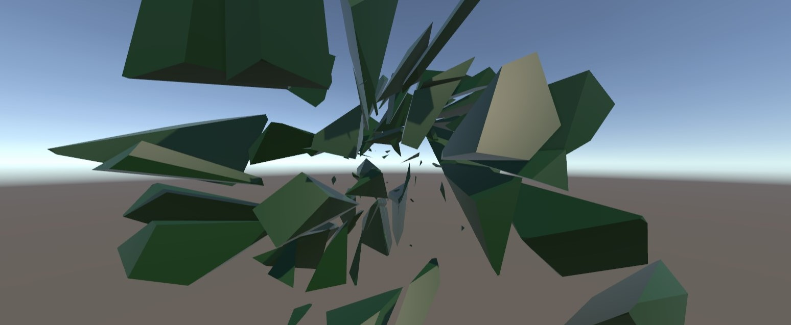

# Destruct plugin



Video: https://www.youtube.com/watch?v=tsPRKVZiDr0
Multiplayer implementation: https://github.com/Metran10/Destruct-Example

## About

This small plugin provides a functionality that will help you implement authentic destruction of objects in your Unity game.

## Installation

There are 2 ways to install this plugin:

- clone/download this repository and move the Plugins folder to your Unity project's Assets folder

- use the "add package from git url" option in the Unity Package Manager

## Usage

This plugin contains 3 scripts:

- `Destruct.cs` containing the main functionality of the library

- `IDestructible.cs` that defines an interface, implementation of which has to be placed on a GameObject that we want to destroy

- `BasicDestructible.cs` containing an example of an implementation of the `IDestructible` intefrace

The most important part of the plugin is the `Destruct(IDestructible script, int granularity)` function. It takes a script implementing the interface that provides data necessary for executing destruction and a `granularity` argument that defines how fine the destruction result should be.

To use the destruction you need to first implement the interface. As part of the implementation you will need to write functions that provide `MeshFilter` and `Transform` data of the object to be destroyed. This is very simple, as we can see in the below example from the `BasicDestructible.cs` file:

```cs
    MeshFilter mFilter;
    
    void Start()
    {
        mFilter = GetComponent<MeshFilter>();
    }

    MeshFilter IDestructible.GetMeshFilter(){
        return mFilter;
    }

    Transform IDestructible.GetTransform(){
        return transform;
    }
```

Next we need to implement functions that will be called before and after the destruction. In this example we will nort have any functionality before destruction:
```cs
void IDestructible.PreDestruct(){
        return;
    }
```

 `PostDestruct(List<SplitResult> destructionResults)` function receives a list of `SplitResult` objects that contain vertices and triangles of meshes that are the result of destruction. We can use them to create new game objects:

```cs
void IDestructible.PostDestruct( List<SplitResult> destructionResults ){
        Functions.InstantiateObjectsFromSplitResults(destructionResults, transform.position, transform.rotation, GetComponent<MeshRenderer>().material);

        Destroy(gameObject);
    }
```

Now we are ready to blow something to pieces! Create a game object with a `MeshFilter` component and add `BasicDestructible.cs` or your own implementation of the interface to it. All that needs to be done now is to call the destruct function, for example when a raycast hits the object with the script:

```cs
int granularity = 8;

RaycastHit hit;
if (Physics.Raycast(transform.position, transform.TransformDirection(Vector3.forward), out hit, Mathf.Infinity))
{
    IDestructible destructible = hit.collider.gameObject.GetComponent<IDestructible>();
    if(destructible is not null){
        Functions.Destruct(destructible, granularity);
    }
}
```

You can easly implement your own, more advanced, destruction behaviour through your own `IDestructible` implementations!

## Limitations

Provided destruction mechanism does not support:
- multiple materials
- recalculating UVs
- concave meshes
- self-intersecting meshes